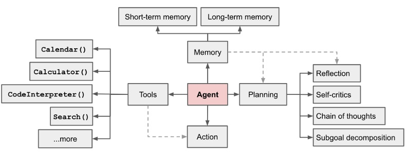
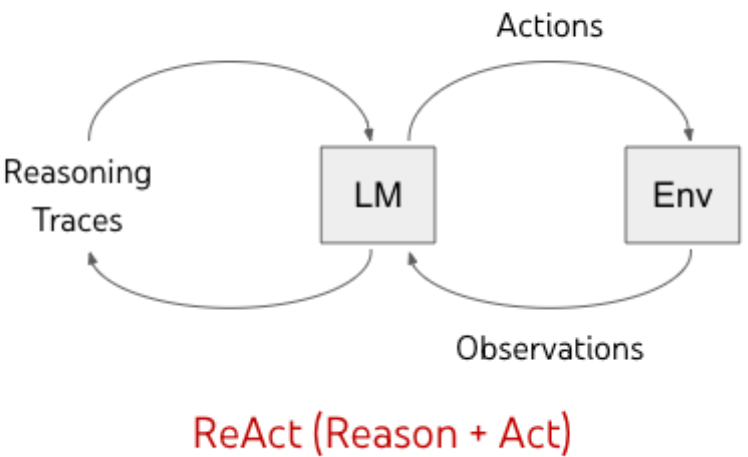

# AI Agent 淺談

## 什麼是 AI Agent?

AI Agent 與一般的大型語言模型(LLM)最大的差異在於其具有自主性(Agency)和目標導向的特性。

一般的 LLM:
- 單次對話，無記憶能力
- 無法主動採取行動
- 僅能進行文本生成對話

AI Agent:
- 具有自主決策能力 (Planning)
- 可以記住上下文或是以知識庫內容來回應對話 (Memory)
- 能夠主動採取行動實現目標 (Action)
- 可以使用工具和 API 完成任務 (Tool)

舉例來說:
1. Auto-GPT: 能夠自主規劃並完成一系列任務，如市場調研、寫程式碼等
2. 客戶服務: AI Agent 可以作為智能客服代表，根據客戶的問題自動查詢知識庫相關資訊、提供解決方案。
3. 自動駕駛: AI Agent 可以在自動駕駛系統中扮演重要角色，幫助車輛感知周圍環境、做出駕駛決策並執行動作。例如辨識行車標誌，該正確的時機進行提速或是減速。

AI Agent 就像是一個具有思考能力的助手，不只是回答問題，還能主動幫助我們完成複雜的工作流程。

## Agent 的組成
### 1. Planning - 自主決策能力

AI Agent 的自主決策能力主要包含任務分解、規劃、自我反思等，其實主要就是 prompting 的技巧

#### a. 思維鏈 (Chain of Thoughts, CoT)
在這篇研究論文（https://arxiv.org/pdf/2201.11903.pdf ） 中，探討如何利用chain-of-thought prompting方法，來提升大型語言模型的推理能力。
它將會引導 LLM:
- 將複雜問題拆解成多個步驟
- 逐步推理並記錄思考過程
- 最後得出結論

例如:
計算 13 x 27
- 先把 27 拆成 20 + 7
- 13 x 20 = 260
- 13 x 7 = 91
- 260 + 91 = 351

#### b. ReAct (Reasoning + Acting)
ReAct （Reason+Act） 是由推理和行動兩個字所組而成

- **推理（Reasoning）**: 
推理是指 AI 根據資訊進行思考並得出結論的過程:
    - 使用現有知識和新獲取的資訊進行分析
    - 透過 Chain-of-Thought 方式一步步推理
    - 結合外部知識來源以提高準確性

    主要優點:
    - 能與外界即時互動交流
    - 減少模型產生幻覺的機率 (不要唬爛)
    - 避免因錯誤資訊而得出錯誤結論

- **行動（Action）**: 
讓 LLM 根據需求，思考是否尋求外部工具或使用哪一種工具的協助，在需要的時候呼叫工具進一步取得新資訊，例如使用 google search 或計算機等工具。

**例如:**
訂購披薩
- 思考:需要什麼口味、尺寸
- 行動:打開訂餐 App
- 觀察:查看菜單選項
- 思考:選擇合適的品項
- 行動:下單付款

#####  現有使用 ReAct prompting 的框架
可以快速的使用在各種任務上，省去摸索的過程
https://smith.langchain.com/hub/
https://smith.langchain.com/hub/captain/react

### 2. Memory - 上下文記憶

#### a. 短期記憶
短期記憶是指 AI Agent 在對話過程中能夠記住近期的對話內容和上下文信息。主要通過以下技術實現:

- Cache: 高效存儲臨時數據的機制,可快速訪問最近使用的信息
- 上下文窗口: 用於處理和記住當前會話中的信息

主要特點:
- 容量有限,通常只保存最近的對話內容
- 處理當前任務或會話中的臨時信息
- 信息保留時間較短,重啟後會清空

#### b. 長期記憶
長期記憶用於存儲需要長期保留的信息,通過以下技術實現:

- 數據庫: 使用關係型或非關係型數據庫進行持久化存儲
- 知識圖譜: 表示實體及其關係的結構化數據模型
- 文件系統: 將信息存儲在文件中以便長期訪問
- 向量數據庫: 存儲和檢索高維向量數據

優點:
- 能夠長期保存和檢索複雜知識
- 支持跨會話的信息持久化
- 有助於個性化服務和決策優化

### 3. Action & Tool - 調用工具
AI Agent 的調用工具能力是其實現任務的關鍵組成部分，這一過程涉及到如何有效地選擇和使用外部工具來增強其功能。

- 需求識別
AI Agent 首先需要判斷當前任務是否需要外部工具的協助。這通常基於對用戶請求的分析，以及對當前上下文的理解。

- 工具選擇
一旦確定需要外部工具，AI Agent 會根據任務需求選擇合適的工具。例如，若需要查詢某個問題，可能會選擇使用搜索引擎；若需要進行計算，則可能會調用計算器。

- 執行與觀察
AI Agent 發送請求給外部工具並等待回應。這一過程中，Agent 會持續監控執行狀態，以便在必要時進行調整或重試。

- 最終輸出
經過一系列的推理和工具調用後，AI Agent 最終將生成一個完整的回答或行動方案，並將其提供給用戶。

**例如，在訂購披薩的場景中：**

思考階段：AI Agent 需要考慮客戶的需求，如口味、尺寸等。

行動階段：它會打開訂餐應用程序。

觀察階段：查看菜單選項以獲取最新信息。

思考與決策階段：根據菜單選擇合適的品項。

最終行動：下單並完成付款。

##### reference
https://www.promptingguide.ai/zh/techniques/cot

https://medium.com/vincent-chen/ai-agent%E6%A6%82%E5%BF%B5%E5%8F%8A%E5%85%B6%E6%87%89%E7%94%A8-e66c88e9a015

https://agijuejin.feishu.cn/wiki/Y5vwwkyc2iDfunkNrVgcyfERnNe

https://cloud.baidu.com/article/3373829

https://www.promptingguide.ai/zh/techniques/reflexion

https://ithelp.ithome.com.tw/articles/10348597

https://arxiv.org/pdf/2201.11903.pdf

https://smith.langchain.com/hub/

https://python.langchain.com/docs/introduction/

